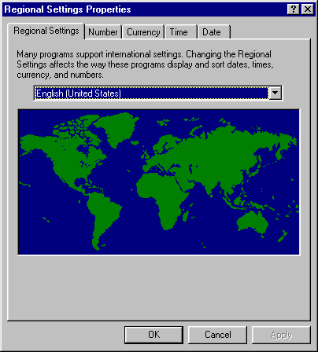

# 政治技术问题

> :fontawesome-regular-face-grin: Y.D.X.
>
> :material-clock-edit-outline: 2024年12月12日 0:36:42

操作系统需要显示时间，因而有地区设置。在初版 Windows 95 中，你选的地区会直接显示到世界地图上。在当时应该还挺惊艳的？

<figure markdown='span'>
    
    <figcaption markdown='1'>[Windows 95 中的地区设置](https://guidebookgallery.org/screenshots/win95)</figcaption>
</figure>

不过这一功能数月后就被删除了。因为当时秘鲁和厄瓜多尔打仗，秘鲁政府要求微软把边界往北挪。微软认为挪了之后厄瓜多尔政府又会要求挪回去，所以把整个功能删除了。

:material-eye-arrow-right-outline: [Why isn't my time zone highlighted on the world map? - The Old New Thing](https://devblogs.microsoft.com/oldnewthing/20030822-00/?p=42823)

🇨🇳等国旗 emoji 也有类似问题。

Unicode当然无权规定政治。它的做法是用 U+1F1E6..U+1F1FF 编码26个拉丁字母，用 ISO 3166 地区代码表示。例如中国的代码是 CN，分别是第3和第14个字母，编码为`🇨`（U+1F1E8）和`🇳`（U+1F1F3）。

字体决定了这些码具体显示成什么样。如果字体不支持，可能直接显示出`CN`，只与普通字母略有区别。

运行以下 python 程序可获得这两个字符。你可以试着粘贴到记事本、浏览器等处，看看有什么效果。

```python
>>> from unicodedata import lookup
>>> "".join(lookup(f"regional indicator symbol letter {x}") for x in "CN")
'🇨🇳'
>>> base = ord(lookup("regional indicator symbol letter A"))
>>> "".join(chr(base + ord(x) - ord("A")) for x in "CN")
'🇨🇳'
```

:material-eye-arrow-right-outline: [Regional Indicator Symbols - §22.10.4 Enclosed Alphanumeric Supplement: U+1F100–U+1F1FF – Unicode 16.0.0](https://www.unicode.org/versions/Unicode16.0.0/core-spec/chapter-22/#G39861)

↑ Unicode 核心规范有网页版了，链接可以精准定位。
